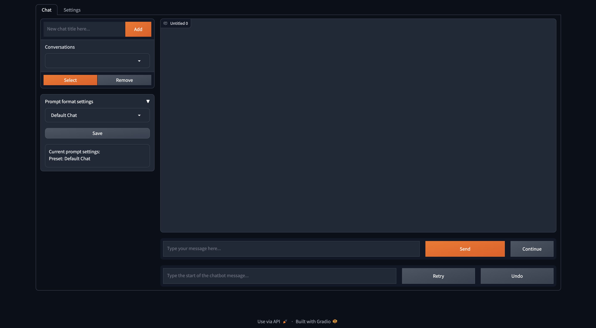

# LLMPlus

LLMPlus is a python package that allows python developers to work with different large language models (LLM) and do prompt engineering with a simple interface. It favours free and local resources instead of using paid APIs to develop truely local and private AI-powered solutions.

It provides classes to load LLM models, embedding models, and vector databases to create LLM powered applications with your own prompt engineering and RAG techniques. With a one-liner command, you can load a chatbot interface to chat with the LLM or serve a model as OpenAI API as well.  

## Features
### 1. Multilple LLMs with different genration configurations from one model 
Unlike Langchain, you can create multiple LLMs with different temperature, max new tokens, stop words etc. with the same underlying model without loading the model several times using the `LlmFactory` class. This can be useful when you create your own agent with different LLM tasks which requires different configurations.

### 2. Langchain compatibility with enhanced performances
All the LLMs created with `LlmFactory` are langchain compatible, and can be seamlessly integrated in your existing Langchain code. All the LLM classes are re-implementations of some langchain LLM classes which support more efficient streaming and stop words management, all with a unified interface.

### 3. Multiple model formats support
Multiple model formats are all supported, and the loading process are all handled in the `LlmFactory` class, so it is just plug and play. 
Supported formats:
* __PyTorch__ (using transformers)
* __GGUF__ (using llama-cpp-python)
* __AWQ__ (using transformers)
* __GPTQ__ (using transformers)
* __OpenAI API__ (Work with any local servers that serve models with OpenAI API format)

### 4. Embedding Toolkits
Bundled classes for using embedding models which contains the embedding model and a tokens-count-based text splitter using the embedding model.

### 5. Vector database
Utilising Embedding toolkits and FAISS, a `VectorDatabase` class can allow you to store and search texts for your RAG tasks.

### 6. Chat memories
Chat memory classes for storing chat memory on disk.  
1. `BaseChatMemory`  
Memory class without using any embedding models or vector databases.  

2. `LongShortTermChatMemory`  
Memory class using an underlying `VectorDatabase` to maintain long term memory along with the most recent memory.

### 7. Prompt template
A `PromptTemplate` class is implemented to format your prompt with different prompt formats for models from different sources. Some presets like `Llama2`, `ChatML`, `Vicuna`, and more are already implemented, but you can alway add your own prompt format template.

### 8. Custom tools
A base class `BaseTool` for creating llm powered tools. A `WebSearchTool` powered by __DuckDuckGo__ is implemented as an example.

### 9. Chatbot frontend interface
If you simply want to play with a model, there's a gradio frontend chatbot that allows you to chat with a model with different generation configurations. You can switch between chat histories and prompt format, and you can set your system prompt and other model text generation sampling configurations in the gradio webapp.

## Prerequisites

Before you begin, make sure your python version is >= 3.9. Creating a virtual python environment with conda is highly recommended before installing the package.

### Pytorch
It is highly recommended to install PyTorch before you go ahead to install LLMPlus. Install it with the official installation guidelines with your machine [here](https://pytorch.org/get-started/locally/).

### Llama-cpp-python
If you want to use GGUF models with this package, please install [llama-cpp-python](https://pypi.org/project/llama-cpp-python/) with the correct CMake arguments according to the llama-cpp-python installation guide. 

## Installing LLMPlus

You can install LLMPlus with pip easily.

```
pip install git+https://github.com/nath1295/LLMPlus.git
```

## Using LLMPlus

### 1. Create LLMs
This is how you can start with any text generation model on HuggingFace with your machine.

```python
from llmplus import LlmFactory

# Load the model from Huggingface
model = LlmFactory("TheBloke/OpenHermes-2.5-Mistral-7B-GGUF")

# Create a llm
llm = model(temperature=0.7, max_new_tokens=512, stop=['```'])

# Use the LLM for your task
prompt = """Instruction:
Write a python script to load a Pandas Dataframe from the csv file 'test.csv'

Solution:
```python
"""
script = llm(prompt)
print(script)

# Or if you prefer to generate the output with token streamming.
for token in llm.stream(prompt):
    print(token, end="")
```

### 2. Load embeddings toolkit and create vector database
To load an embedding model and use a vector database:

```python
from llmplus import HuggingfaceEmbeddingsToolkit, VectorDatabase

# Loading the embedding model toolkit
embeddings = HuggingfaceEmbeddingsToolkit(model_id="thenlper/gte-large")

# Create a vector database
food = ["Apple", "Banana", "Pork"]
vectordb = VectorDatabase.from_data(index=food, embeddings=embeddings)

# Do semantic search on the vector database
print(vectordb.search("Beef"))
```

### 3. Use memory and prompt template to create a chatbot
Use the Memory classes and the `PromptTemplate` class to create a chatbot.
```python
from llmplus.Memory import LongShortTermChatMemory, create_long_short_prompt
from llmplus.Prompts import PromptTemplate

# Create the memory with the embeddings toolkit created earlier
memory = LongShortTermChatMemory(title="My first conversation with OpenHermes", embeddings=embeddings, from_exist=False)

# Get a prompt template
prompt_template = PromptTemplate.from_preset("ChatML")

# Create an llm from the model factory
chat_llm = model(max_new_tokens=512, stop=prompt_template.stop + ["###"])

# Create the prompt for the llm
user_input = "What is the meaning of life?"
prompt = create_long_short_prompt(
    user_input=user_input,
    prompt_template=prompt_template,
    llm=chat_llm,
    memory=memory
)

# Generating the response from the model
output = ""
for token in chat_llm.stream(prompt):
    output += token
    print(token, end="")

# Save the interaction between you and the chatbot
memory.save_interaction(user_input=user_input, assistant_output=output)
```
### 4. Use tools
A `WebSearchTool` class is implemented as an example to build a tool with LLMPlus. The tool is using __DuckDuckGo__ by default. Here is how you can use it:
```python
from llmplus.Tools import WebSearchTool

# Create a web search tool with the embeddings toolkit created earlier
tool = WebSearchTool(embeddings=embeddings, verbose=True)

# Run the tool with the previsous chat memory for a more coherent response
tool_input = "Can you give me some views of the meaning of life from some famous philosophers?"
output_generator = tool.run(tool_input, 
    llm=chat_llm, 
    history=memory.get_recent_memory(last_k=2), 
    prompt_template=prompt_template,
    return_type="response",
    stream=True)

tool_output = ""
for token in output_generator:
    tool_output += token
    print(token, end="")

# And save the response to the memory
memory = memory.save_interaction(user_input=tool_input, assistant_output=tool_output)
```

### 5. Chat with the model in Gradio web app
Or if you just want a GUI to start chatting with your LLM model with both long term and short term memory, type this command in the terminal:
```bash
llmplus interface --model_id TheBloke/OpenHermes-2.5-Mistral-7B-GGUF --embeddings thenlper/gte-large
```
You will see a gradio frontend, use it to chat with the LLM model.  


### 6. Serve an OpenAI API with a GGUF model
To serve a GGUF model with OpenAI API:
```bash
llmplus serve --model_id TheBloke/OpenHermes-2.5-Mistral-7B-GGUF --model_file openhermes-2.5-mistral-7b.Q6_K.gguf --context_size 4096
```

## Documentations
Python documentation for all the classes, methods, and functions is provided in the `./docs` directory in this repository.

## License
This project is licensed under the terms of the MIT license.
