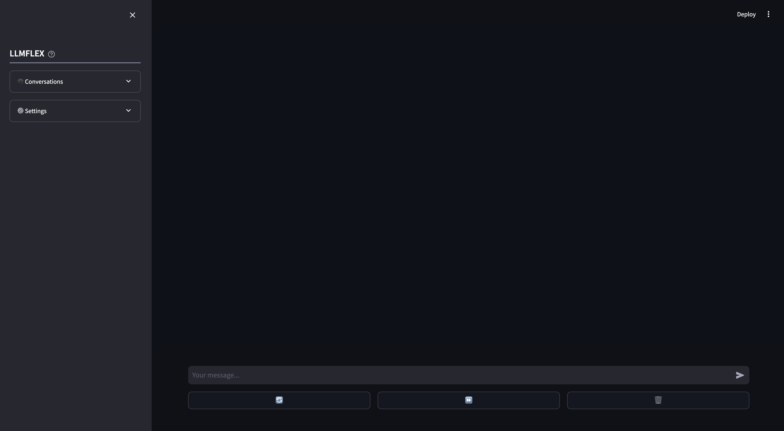

# LLMFlex
[](https://pypi.org/project/llmflex/)
[](https://pypi.org/project/llmflex/)
[](https://pypi.org/project/llmflex/)

## A python package for developing AI applications with local LLMs
LLMFlex is a python package that allows python developers to work with different large language models (LLM) and do prompt engineering with a simple interface. It favours free and local resources instead of using paid APIs to develop truly local and private AI-powered solutions.

It provides classes to load LLM models, embedding models, and vector databases to create LLM powered applications with your own prompt engineering and RAG techniques. With a one-liner command, you can load a chatbot interface to chat with the LLM or serve a model as OpenAI API as well.

## Installing LLMFlex
Creating a virtual environment before installing the package is highly recommended. Also make sure you have installed [Pytorch](https://pytorch.org/get-started/locally/) and [llama-cpp-python](https://pypi.org/project/llama-cpp-python/) with the correct installation method according to your hardware configuration before installing LLMFlex. Please visit the links provided for the respective packages for more detailed installation guides.

After you have done the above steps, you can easily install llmflex with `pip`.
```
pip install llmflex
```

You can also install [ExLlamaV2](https://github.com/turboderp/exllamav2), [AutoAWQ](https://pypi.org/project/autoawq/0.1.1/), and [AutoGPTQ](https://pypi.org/project/auto-gptq/) if you have CUDA devices. Please visit the links provided for the respective packages for more detailed installation guides.

## Features
### 1. Multilple LLMs with different genration configurations from one model 
Unlike Langchain, you can create multiple LLMs with different temperature, max new tokens, stop words etc. with the same underlying model without loading the model several times using the `LlmFactory` class. This can be useful when you create your own agent with different LLM tasks which requires different configurations.

### 2. Langchain compatibility with enhanced performances
All the LLMs created with `LlmFactory` are langchain compatible, and can be seamlessly integrated in your existing Langchain code. All the LLM classes are re-implementations of some langchain LLM classes which support more efficient streaming and stop words management, all with a unified interface.

### 3. Multiple model formats support
Multiple model formats are all supported, and the loading process are all handled in the `LlmFactory` class, so it is just plug and play. 
Supported formats:
* __PyTorch__ (using transformers)
* __GGUF__ (using llama-cpp-python)
* __AWQ__ (using transformers)
* __GPTQ__ (using transformers)
* __OpenAI API__ (Work with any local servers that serve models with OpenAI API format)
* __EXL2__ (using exllamav2)

### 4. Embedding Toolkits
Bundled classes for using embedding models which contains the embedding model and a tokens-count-based text splitter using the embedding model.

### 5. Vector database
Utilising Embedding toolkits and FAISS, a `VectorDatabase` class can allow you to store and search texts for your RAG tasks.

### 6. Chat memories
Chat memory classes for storing chat memory on disk.  
1. `BaseChatMemory`  
Memory class without using any embedding models or vector databases.  

2. `LongShortTermChatMemory`  
Memory class using an underlying `VectorDatabase` to maintain long term memory along with the most recent memory.

### 7. Prompt template
A `PromptTemplate` class is implemented to format your prompt with different prompt formats for models from different sources. Some presets like `Llama2`, `ChatML`, `Vicuna`, and more are already implemented, but you can alway add your own prompt format template.

### 8. Custom tools
A base class `BaseTool` for creating llm powered tools. A `BrowserTool` powered by __DuckDuckGo__ is implemented as an example.

### 9. Chatbot frontend interface
If you simply want to play with a model, there is a streamlit frontend chatbot that allows you to chat with a model with different generation configurations. You can switch between chat histories and prompt format, and you can set your system prompt and other model text generation sampling configurations in the webapp.

## Using LLMFlex

### 1. Create LLMs
This is how you can start with any text generation model on HuggingFace with your machine.

```python
from llmflex import LlmFactory

# Load the model from Huggingface
model = LlmFactory("TheBloke/OpenHermes-2.5-Mistral-7B-GGUF")

# Create a llm
llm = model(temperature=0.7, max_new_tokens=512, stop=['```'])

# Use the LLM for your task
prompt = """Instruction:
Write a python script to load a Pandas Dataframe from the csv file 'test.csv'

Solution:
```python
"""
script = llm.invoke(prompt)
print(script)

# Or if you prefer to generate the output with token streamming.
for token in llm.stream(prompt):
    print(token, end="")
```

### 2. Load embeddings toolkit and create vector database
To load an embedding model and use a vector database:

```python
from llmflex.Embeddings import HuggingfaceEmbeddingsToolkit
from llmflex.VectorDBs import FaissVectorDatabase

# Loading the embedding model toolkit
embeddings = HuggingfaceEmbeddingsToolkit(model_id="thenlper/gte-small")

# Create a vector database
food = ["Apple", "Banana", "Pork"]
vectordb = FaissVectorDatabase.from_texts(embeddings=embeddings, texts=food)

# Do semantic search on the vector database
print(vectordb.search("Beef"))
```

### 3. Use tools
A `WebSearchTool` class is implemented as an example to build a tool with LLMFlex. The tool is using __DuckDuckGo__ by default. Here is how you can use it:
```python
from llmflex.Tools import BrowserTool

# Create a broswer tool with the embeddings toolkit created earlier
tool = BrowserTool(embeddings=embeddings)

# Run the tool
tool(search_query='Install python')
```

### 4. Chat with the model in a Streamlit web app
If you just want a GUI to start chatting with your LLM model with both long term and short term memory, type this command in the terminal:
```bash
llmflex interface
```
If you want to configure the llm model, embedding model, text splitter, and reranker, create a config file and modify it first:
```bash
# Create a config file for the webapp
llmflex create-app-config
```
after modifying the file, run the following:
```bash
llmflex interface --config_dir chatbot_config.yaml
```
You will see a streamlit frontend, use it to chat with the LLM model.  


### 5. Serve an OpenAI API with a GGUF model
To serve a GGUF model with OpenAI API:
```bash
llmflex serve --model_id TheBloke/OpenHermes-2.5-Mistral-7B-GGUF --model_file openhermes-2.5-mistral-7b.Q6_K.gguf --context_size 4096
```

## Documentations
Python documentation for all the classes, methods, and functions is provided in the `./docs` directory in this repository.

## License
This project is licensed under the terms of the MIT license.
